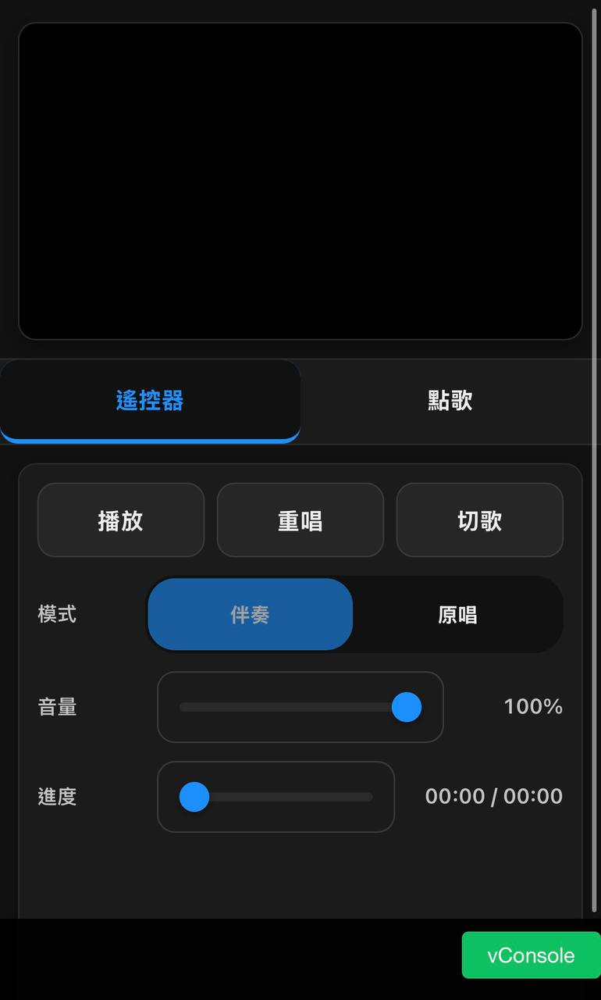
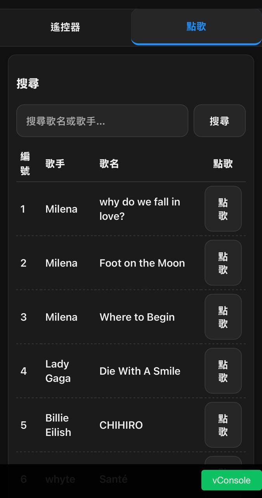
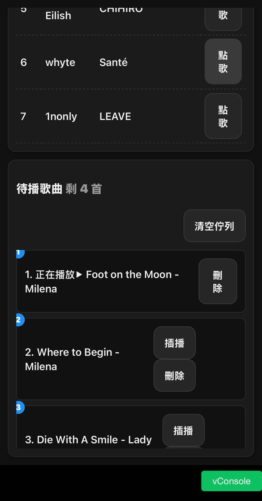
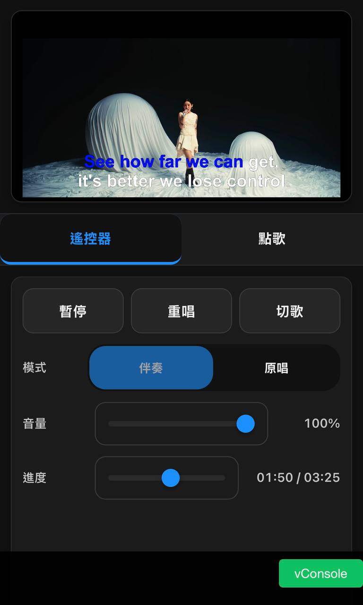
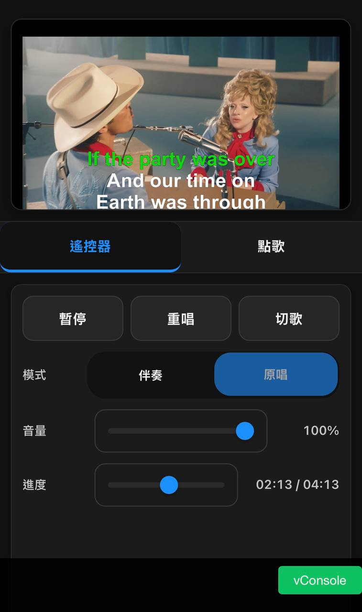

# Mini KTV

一個現代化的網頁版 KTV 系統，支援雙聲道音訊切換（伴奏/原唱）、HLS 串流播放和完整的點歌佇列管理。

## 功能特色

- 🎵 **雙聲道音訊模式**：支援伴奏/原唱模式切換
- 📱 **響應式設計**：適配桌面端和移動端
- 🎬 **HLS 串流播放**：支援 m3u8 格式的高品質影音串流
- 🎤 **點歌佇列管理**：完整的排隊、插播、刪除功能
- 🔍 **歌曲搜尋**：支援歌名和歌手搜尋
- 🎛️ **播放控制**：播放/暫停、重唱、切歌、音量調節
- 🐳 **多種部署方式**：支援 Windows、Linux 和 Docker 部署

## 項目結構

```
KTVProject/
├── src/                    # 前端源碼
│   ├── app.js             # 主要應用邏輯
│   ├── index.html         # 主頁面
│   ├── styles.css         # 樣式表
│   ├── nginx.conf         # Nginx 配置
│   └── Dockerfile         # 容器構建文件
├── db/songs/              # 歌曲資料庫目錄
├── ffmpeg/                # FFmpeg 工具
├── tools/                 # 輔助工具腳本
│   ├── m3u8.ps1          # HLS 轉換腳本
│   ├── mp42mp3.ps1       # 音訊格式轉換
│   └── ytdownload.ps1    # YouTube 下載工具
├── build.bat             # 構建腳本
├── push.bat              # 推送腳本
├── run.bat               # 運行腳本
└── docker-compose.yml    # Docker Compose 配置
```

## 安裝與部署

### 🪟 Windows 部署

#### 前置需求
- Windows 10/11 或 Windows Server
- Nginx for Windows
- PowerShell 5.1+
- FFmpeg

#### 安裝步驟

1. **下載並安裝 Nginx**
   ```cmd
   # 下載 Nginx for Windows
   # 從 http://nginx.org/en/download.html 下載穩定版本
   # 解壓到 C:\nginx
   ```

2. **克隆項目**
   ```cmd
   git clone https://github.com/waynechen251/KTVProject.git
   cd KTVProject
   ```

3. **配置 Nginx**
   ```cmd
   # 複製配置文件到 Nginx 目錄
   copy src\nginx.conf C:\nginx\conf\nginx.conf
   
   # 修改配置文件中的路徑為您的項目路徑
   # 將 /usr/share/nginx/html 替換為 C:/path/to/KTVProject/src
   ```

4. **準備歌曲檔案並轉換**
   ```powershell
   # 執行 HLS 轉換
   .\tools\m3u8.ps1
   ```

5. **啟動服務**
   ```cmd
   # 啟動 Nginx
   C:\nginx\nginx.exe
   
   # 檢查服務狀態
   tasklist /fi "imagename eq nginx.exe"
   ```

6. **訪問應用**
   打開瀏覽器訪問：`http://localhost:80`

#### 管理命令
```cmd
# 停止 Nginx
C:\nginx\nginx.exe -s stop

# 重新載入配置
C:\nginx\nginx.exe -s reload

# 測試配置
C:\nginx\nginx.exe -t
```

### 🐧 Linux 部署

#### 前置需求
- Ubuntu 20.04+ / CentOS 8+ / Debian 11+
- Nginx
- FFmpeg
- Git

#### 安裝步驟

1. **安裝依賴**
   ```bash
   # Ubuntu/Debian
   sudo apt update
   sudo apt install nginx ffmpeg git -y
   
   # CentOS/RHEL
   sudo yum install nginx ffmpeg git -y
   ```

2. **克隆項目**
   ```bash
   git clone https://github.com/waynechen251/KTVProject.git
   cd KTVProject
   ```

3. **配置 Nginx**
   ```bash
   # 備份原配置
   sudo cp /etc/nginx/nginx.conf /etc/nginx/nginx.conf.backup
   
   # 複製項目配置
   sudo cp src/nginx.conf /etc/nginx/nginx.conf
   
   # 修改配置文件中的路徑
   sudo sed -i "s|/usr/share/nginx/html|$(pwd)/src|g" /etc/nginx/nginx.conf
   
   # 測試配置
   sudo nginx -t
   ```

4. **設置權限**
   ```bash
   # 設置適當的檔案權限
   sudo chown -R www-data:www-data .
   sudo chmod -R 755 .
   ```

5. **準備歌曲檔案並轉換**
   ```bash
   # 安裝 PowerShell (如需要)
   # Ubuntu
   sudo snap install powershell --classic
   
   # 執行 HLS 轉換 (需要 PowerShell)
   pwsh ./tools/m3u8.ps1
   
   # 或者使用 bash 版本的轉換腳本
   # (需要另外編寫 bash 版本)
   ```

6. **啟動服務**
   ```bash
   # 啟動 Nginx
   sudo systemctl start nginx
   
   # 設置開機自啟
   sudo systemctl enable nginx
   
   # 檢查狀態
   sudo systemctl status nginx
   ```

7. **防火牆設置**
   ```bash
   # Ubuntu (ufw)
   sudo ufw allow 80
   
   # CentOS (firewalld)
   sudo firewall-cmd --permanent --add-port=80/tcp
   sudo firewall-cmd --reload
   ```

8. **訪問應用**
   打開瀏覽器訪問：`http://your-server-ip:80`

#### 管理命令
```bash
# 重新載入 Nginx 配置
sudo systemctl reload nginx

# 重啟 Nginx
sudo systemctl restart nginx

# 查看 Nginx 日誌
sudo tail -f /var/log/nginx/access.log
sudo tail -f /var/log/nginx/error.log
```

### 🐳 Docker 部署

#### 前置需求
- Docker 20.10+
- Docker Compose 1.29+

#### 快速開始

1. **克隆項目**
   ```bash
   git clone https://github.com/waynechen251/KTVProject.git
   cd KTVProject
   ```

2. **構建 Docker 映像**
   ```batch
   # Windows
   build.bat
   
   # Linux/macOS
   docker-compose build
   ```

3. **運行服務**
   ```batch
   # Windows
   run.bat
   
   # Linux/macOS
   docker-compose up -d
   ```

4. **訪問應用**
   打開瀏覽器訪問：`http://localhost:8080`

#### Docker 管理命令
```bash
# 查看運行狀態
docker-compose ps

# 查看日誌
docker-compose logs -f

# 停止服務
docker-compose down

# 重建並重啟
docker-compose up -d --build

# 清理未使用的映像
docker system prune -a
```

### 歌曲資料準備 (通用)

無論使用哪種部署方式，都需要準備歌曲資料：

1. **準備歌曲檔案**
   - 在 `db/songs/` 目錄下建立歌手/歌曲資料夾
   - 每個歌曲資料夾需包含：
     - `mv.mp4` - 影片檔案(無聲影片+字幕)
     - `backing.m4a` - 伴奏音軌(無人聲)
     - `vocal.m4a` - 原唱音軌(原始音訊)

2. **生成 HLS 串流**
   ```powershell
   # Windows/Linux (with PowerShell)
   .\tools\m3u8.ps1
   ```

3. **更新歌曲資料庫**
   將歌曲資訊更新到 [`songs.json`](songs.json)
   ```json
   [
     {
       "id": "unique_int_song_id",
       "title": "song_title",
       "artist": "artist_name",
       "path": "songs/artist_name/song_title/"
     }
   ]
   ```

## 使用方法

### 播放控制

- **播放/暫停**：使用 [`updatePlayPauseButton`](src/app.js) 函數控制
- **模式切換**：透過 [`applyMode`](src/app.js) 在伴奏/原唱間切換
- **音量調節**：使用 [`applyVolume`](src/app.js) 調整主音量
- **進度控制**：透過 [`handleSeek`](src/app.js) 調整播放進度

### 點歌功能

- **搜尋歌曲**：在搜尋框輸入歌名或歌手名稱
- **加入佇列**：點擊「點歌」按鈕使用 [`enqueue`](src/app.js) 函數
- **佇列管理**：支援刪除、插播等操作

### 佇列管理

- **插播功能**：使用 [`insertAfterCurrent`](src/app.js) 將歌曲插入到當前播放後
- **移動位置**：透過 [`moveTo`](src/app.js) 調整歌曲順序
- **移除歌曲**：使用 [`removeAt`](src/app.js) 從佇列中刪除

## 工具腳本

### HLS 轉換工具

[`tools/m3u8.ps1`](tools/m3u8.ps1) - 將 MP4 和音訊檔案轉換為 HLS 格式

```powershell
.\tools\m3u8.ps1
```

### 音訊轉換工具

[`tools/mp42mp3.ps1`](tools/mp42mp3.ps1) - 將 MP4 轉換為 MP3 格式

```powershell
.\tools\mp42mp3.ps1 -InputPath "input.mp4" -OutputPath "output.mp3"
```

### YouTube 下載工具

[`tools/ytdownload.ps1`](tools/ytdownload.ps1) - 從 YouTube 下載影片和音訊

```powershell
.\tools\ytdownload.ps1 -Url "https://youtube.com/watch?v=..." -OutputDir "output/"
```

## 技術架構

### 前端技術

- **JavaScript ES6+**：主要應用邏輯
- **HLS.js**：HTTP Live Streaming 播放支援
- **CSS Grid & Flexbox**：響應式佈局
- **vConsole**：移動端調試支援

### 後端架構

- **Nginx**：靜態檔案服務和反向代理
- **Docker**：容器化部署
- **HLS**：自適應位元率串流

### 核心功能實作

#### 音訊軌道切換

```javascript
function applyMode() {
  const isInstrumental = S.mode === 'instrumental';
  const targetTrackName = isInstrumental ? 'audio_1' : 'audio_2';
  // 切換 HLS 或原生音軌
}
```

#### 佇列管理

```javascript
function enqueue(id) {
  S.queue.push(id);
  if (S.currentIndex === -1) {
    S.currentIndex = 0;
    playCurrent();
  }
  renderQueue();
}
```

## 配置說明

### Docker 配置

[`docker-compose.yml`](docker-compose.yml) 定義了服務配置：
- 端口映射
- 數據卷掛載
- 網路設定

### Nginx 配置

[`src/nginx.conf`](src/nginx.conf) 包含：
- 靜態檔案服務
- MIME 類型配置
- 緩存策略

## 開發指南

### 添加新歌曲

1. 在 `db/songs/歌手名稱/歌曲名稱/` 創建資料夾
2. 放入必要的媒體檔案：`mv.mp4`、`backing.m4a`、`vocal.m4a`
3. 執行 HLS 轉換：`.\tools\m3u8.ps1`
4. 更新 [`songs.json`](songs.json) 資料庫

### 客製化樣式

修改 [`src/styles.css`](src/styles.css) 中的 CSS 變數：

```css
:root {
  --accent: #1e90ff;     /* 主色調 */
  --bg-primary: #111;    /* 主背景色 */
  --text: #eee;          /* 文字顏色 */
}
```

## 授權條款

本項目採用 GNU General Public License v3.0 授權。詳見 [`LICENSE`](LICENSE) 檔案。

## 貢獻指南

歡迎提交 Issue 和 Pull Request！請確保：

1. 遵循現有的代碼風格
2. 添加適當的註釋
3. 測試新功能的相容性

## 故障排除

### 常見問題

1. **HLS 播放失敗**
   - 檢查 [`m3u8.ps1`](tools/m3u8.ps1) 腳本執行是否成功
   - 確認 `.m3u8` 檔案格式正確

2. **音軌切換無效**
   - 確認音訊檔案包含正確的軌道標籤
   - 檢查 [`applyMode`](src/app.js) 函數的軌道名稱匹配

3. **Docker 容器啟動失敗**
   - 檢查端口是否被佔用
   - 確認 Docker 服務正常運行

### 日誌查看

- HLS 轉換日誌：[`tools/m3u8.log`](tools/m3u8.log)
- FFmpeg 處理日誌：檢查對應的 `ffmpeg-logs` 資料夾

---

# DEMO

  
  
  
  
  

---

🎤 **享受您的 KTV 體驗！**